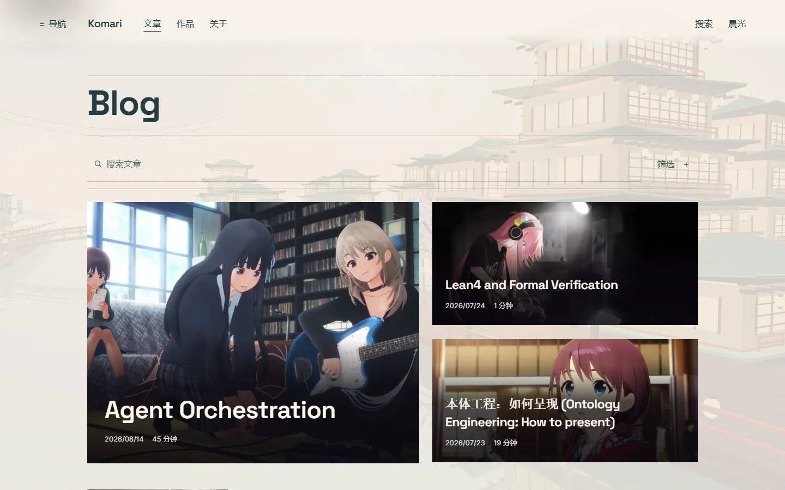
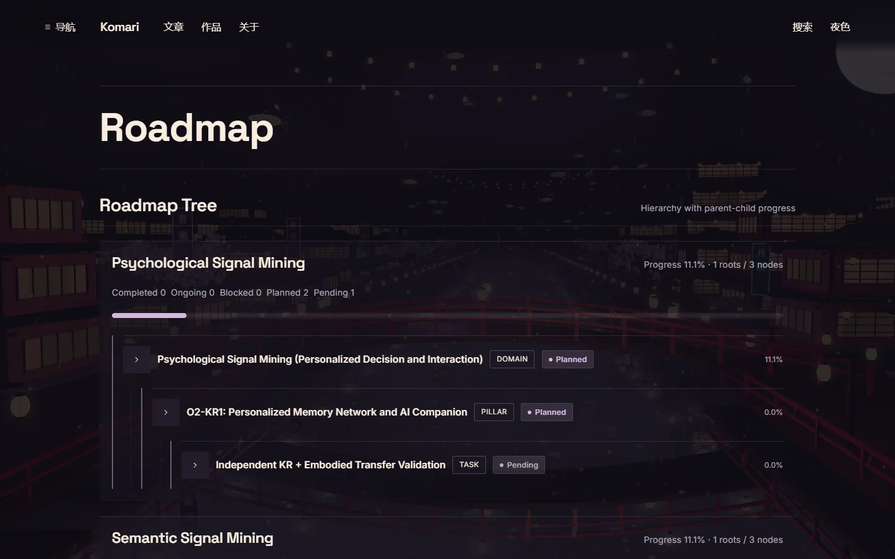
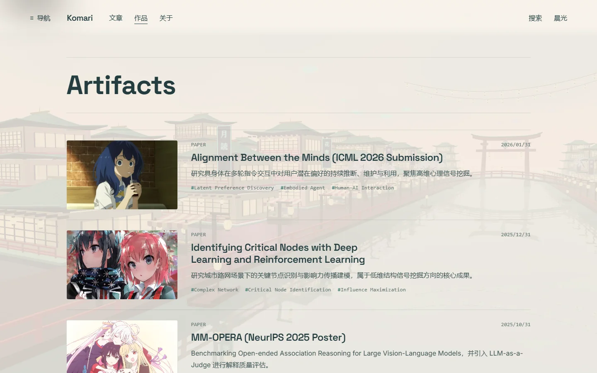
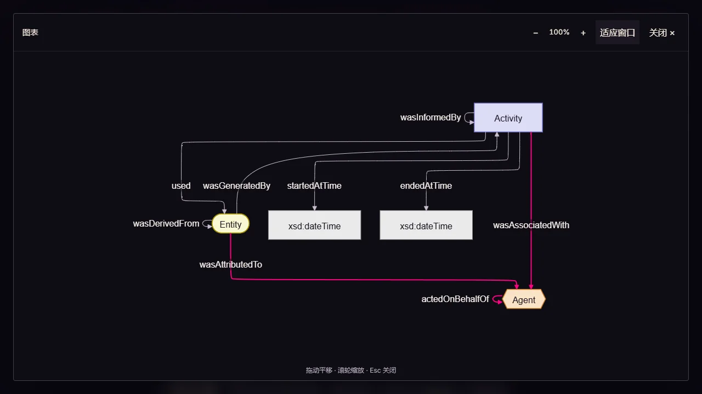
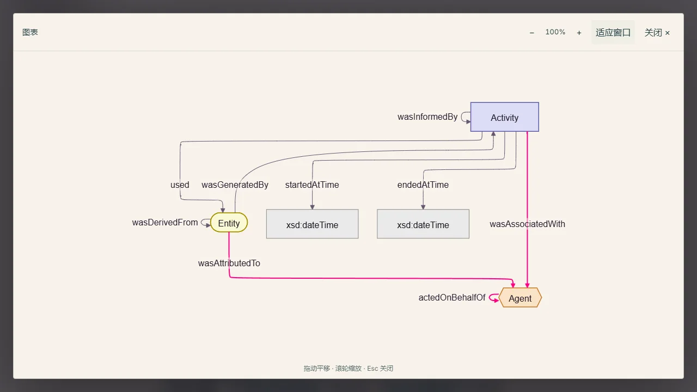
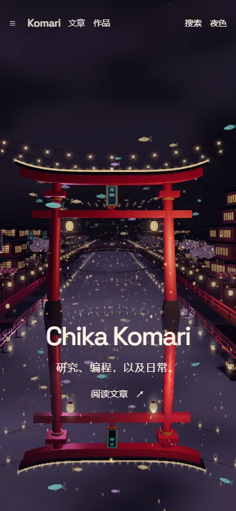

<div align="center">

# Komari

**A moonlit world for research, code, and everyday notes.**

[Explore the site](https://joker-of-gotham.github.io/) · [Blog](https://joker-of-gotham.github.io/blog/) · [Research roadmap](https://joker-of-gotham.github.io/roadmap/) · [中文](README-ZH.md)

Astro · Three.js · TypeScript · Mermaid · Pagefind

</div>

[](https://joker-of-gotham.github.io/)

A personal website by **Chika Komari**. Walk through a six-scene canal town, then settle into essays, research plans, and working projects. The world is rendered in real time; the writing remains ordinary, searchable HTML.

## One world, six scenes

Entrance gate → right-hand street → first bridge → left-hand street → second bridge → exit. Each stop introduces a different part of the site, with typography and camera movement sharing the same scroll position.

Lanterns, flowering trees, waterside stalls, floating fish, clouds, rain, ripples, fireflies, and distant fireworks give the city its rhythm. Switch between a near-black violet night and a warm, pale morning.

[](https://joker-of-gotham.github.io/)

## Built for browsing. Made for reading.

- **Editorial archive.** Recent articles lead with images; older entries form a compact, filterable index.
- **Continuous setting.** Section pages retain their place in the canal. Internal navigation reuses the canvas; detail pages pause it for reading.
- **A closer look.** Images, tables, and Mermaid diagrams open in a zoomable, pannable viewer. Diagrams follow the theme and render near the viewport.
- **Long-form clarity.** Adaptive outline, distinct headings, wrapping tables, dual-theme code, and KaTeX mathematics.
- **Lighter fallback.** Reduced-motion, data-saving, and unavailable-WebGL paths use scene-only posters. Text and links remain available without the 3D renderer.
- **Searchable content.** Astro content collections and a build-time Pagefind index connect posts, research nodes, and artifacts.

[](https://joker-of-gotham.github.io/blog/)

### Research and artifacts

Track a research direction from a domain to its tasks, and browse the papers, systems, and implementations connected to it.

| Research roadmap | Artifacts |
| --- | --- |
| [](https://joker-of-gotham.github.io/roadmap/) | [](https://joker-of-gotham.github.io/artifacts/) |

### Room to examine

Open a diagram and zoom into a relationship. The same viewer handles article images and tables. Use the controls or mouse wheel to zoom, drag to pan, and press **Esc** to return to the text.



<details>
<summary>See the light theme and mobile view</summary>





</details>

### About the author

Research, engineering, and the projects behind the notes.

[](https://joker-of-gotham.github.io/about/)

These are real browser captures of the local production build on **September 8, 2026**, encoded as WebP. They show this working tree; the public site may reflect a different deployed revision. Sources and hashes: [screenshot manifest](docs/screenshots/manifest.json).

## Run locally

Use **Node.js 20.19+** and npm.

```bash
git clone https://github.com/Joker-of-Gotham/Joker-of-Gotham.github.io.git
cd Joker-of-Gotham.github.io
npm ci
npm run dev
```

Open [localhost:4321](http://localhost:4321/). For the production build, including the Pagefind search index:

```bash
npm run build
npm run preview
```

| Command | Purpose |
| --- | --- |
| `npm run dev` | Start Astro development mode |
| `npm run check` | Check Astro and TypeScript |
| `npm run test` | Run unit tests |
| `npm run build` | Build static pages and the Pagefind index |
| `npm run preview` | Serve the production build locally |
| `npm run test:e2e` | Build and run browser tests |
| `npm run verify` | Run checks, unit tests, build, and browser tests |
| `npm run cms:local` | Start the local Decap CMS backend |

Browser tests use Playwright with Google Chrome; install Chrome if it is unavailable.

## How it is made

**Astro** owns routes, content, and document structure. **Three.js** renders procedural geometry, water, lighting, and atmosphere. A shared scroll timeline coordinates the scene and HTML. Astro's client router retains the canvas between routes; direct article visits do not initialize WebGL. **Mermaid + ELK** render diagrams on demand, **KaTeX** handles equations, and **Pagefind** provides static search.

```text
src/
├── components/          Navigation, archives, media, and home experience
├── content/             Posts, roadmap nodes, artifacts, and site configuration
├── lib/observatory/     Scene geometry, atmosphere, camera, and lifecycle
├── lib/                 Content queries, outline, diagrams, and media viewer
├── pages/               Home, blog, roadmap, artifacts, about, and search
└── styles/              Themes, typography, layouts, and motion
public/                  Static assets and Decap CMS
scripts/                 Asset preparation and screenshot encoding
tests/                   Unit and browser checks
docs/                    Content guides, design notes, and asset provenance
```

## Write and customize

| Content | Location |
| --- | --- |
| Articles | `src/content/blog/<collection>/*.md` |
| Research nodes | `src/content/roadmap/<node_level>/*.md` |
| Artifacts | `src/content/artifacts/<type>/*.md` |
| Homepage configuration | `src/content/site/home.yml` |

Use `related_nodes`, `related_posts`, and `related_artifacts` to connect entries. Roadmap nodes use `node_level` (`domain`, `pillar`, `initiative`, or `task`), `parent`, and `sort_order` to form a tree.

For visual editing, run `npm run cms:local` and `npm run dev` in separate terminals, then open [/admin/](http://localhost:4321/admin/). Hosted CMS login requires an OAuth proxy in [public/admin/config.yml](public/admin/config.yml). The proxy must be deployed and configured separately.

See the [documentation index](docs/README.md), [frontmatter guide](docs/frontmatter-and-tags.md), [Markdown guide](docs/markdown-presentation.md), and [image guide](docs/image-guide.md). Update [astro.config.mjs](astro.config.mjs) and owner-specific configuration before using another domain or account.

## Deployment

The [GitHub Actions workflow](.github/workflows/deploy.yml) builds Astro, generates the search index, and publishes `dist/` to GitHub Pages on pushes to `main` or a manual run. Configure Pages to use **GitHub Actions** in repository settings.

## Design and credits

The canal world is a personal interpretation inspired by Tsukuyomi in *Cosmic Princess Kaguya!*. The runtime city is procedural; it does not load film stills as scene backgrounds. This independent personal site has no official affiliation.

[Kage by Meng To](https://github.com/MengTo/kage) is a reference for the relationship between scene, typography, and scroll, and for this README's visual-first presentation. This site's implementation and content structure are distinct.

See the [asset provenance ledger](docs/asset-provenance.md) for imagery origins and recorded use conditions. Third-party code and artwork retain their respective rights. No blanket reuse license is supplied for this repository; check permissions before redistributing content or assets.

---

[Visit Komari](https://joker-of-gotham.github.io/) · [GitHub profile](https://github.com/Joker-of-Gotham) · [Read in Chinese](README-ZH.md)

If the experience or implementation is useful to you, a star helps others find it.
