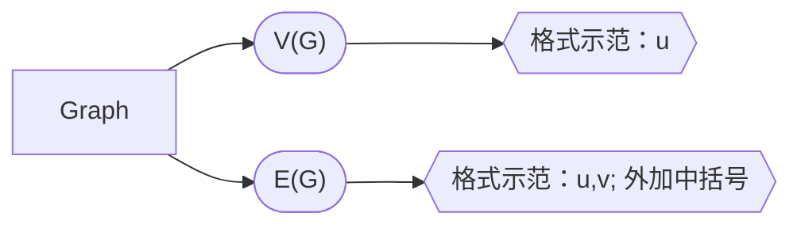
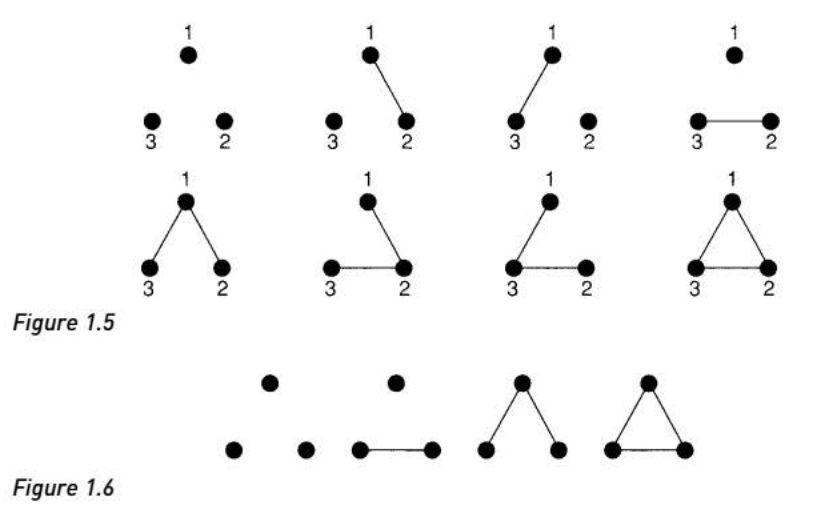

## 图的定义与基础概念

**图的组成**：节点集[V(G)]，边集[E(G)]

### 图的重构(isomophism)

图的重构可以采用如下的数学逻辑描述：

$$ for \ G_1 \ and \ G_2, E_1(G) \leftrightarrow E_2(G) $$

> **注意点：节点是否标记对图的影响**
> 当节点标记后，图的路径显然会多于未标记时的路径
> 

### 图的连接(connected graph)

图的连接可以采用如下的数学逻辑描述：

$$ 
    \begin{aligned}
    & G_{connected} = G_1 \bigcup G_2 \\ & \to E(G_{connected})=E(G_1)\bigcup E(G_2)  \\ & \to V(G_{connected})=V(G_1)\bigcup V(G_2) 
    \end{aligned}
$$

