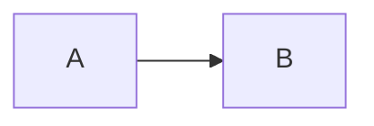

# Markdown 呈现方式规范

本文件规定文章正文的呈现方式怎么打：提示框、引用、代码段、数学、Mermaid、表格、图片等。

**样式事实源**：[src/styles/global.css](../src/styles/global.css)；**构建配置事实源**：[astro.config.mjs](../astro.config.mjs)。本文档与样式冲突时以样式为准。

构建管线要点（来自 `astro.config.mjs`）：

- 语法高亮：Shiki
- 数学：`remark-math` + `rehype-katex`（`strict: "ignore"`，旧文含 CJK/特殊标点也不报错）
- Callout 标记：`remarkLegacyCallout`（解析 `{: .prompt-xxx }` 尾缀，见 §1）

---

## 一、提示框 / Callout（`{: .prompt-xxx }`）

### 1.1 机制

在**引用块**末尾单独一行写 `{: .prompt-xxx }`，`remarkLegacyCallout` 会把该 class 附到引用块（`<blockquote>`）上，CSS 再据此上色。被识别为 callout 的引用块不会走普通引用样式。

写法有两种：

- **块尾标记**（推荐，最稳）：引用块结束的下一行（或末行）单独写 `{: .prompt-xxx }`。
- **行尾标记**：写在引用块内最后一行末尾，如 `> 内容 {: .prompt-info }`。

> 插件会把 class 提升到外层 `<blockquote>`，即使标记被 Markdown 解析器当作 lazy-continuation 吸收进引用块内部的段落或列表项，class 仍会落在 `<blockquote>` 上（旧版插件会错位到内部 `<p>`，已修复）。

> 注意：`code` / `inlineCode` / `math` / `inlineMath` 内部的 `{: ... }` 会被忽略，不会被误解析。

### 1.2 可用类型与语义

| 类名 | 颜色（见 design-tokens） | 语义 | 何时用 |
|------|------|------|------|
| `prompt-info` | `--accent-blue` 蓝 | 背景知识 / 术语约定 / 补充说明 | 介绍前置概念、约定术语时 |
| `prompt-proof` | `--accent-cyan` 青 | 定理证明 / 推导 / 定义 | 形式化定义、证明、推导过程 |
| `prompt-attention` | `--accent-amber` 琥珀 | 注意 / 易错点 / 关键提醒 | 指出坑、易混点、不可靠之处 |
| `prompt-warning` | `--accent-amber` 琥珀 | 警告（与 attention 同色） | 已废弃，新文用 `prompt-attention` |
| `prompt-example` | `--accent-violet` 紫 | 案例 / 示例 | 具体案例、SQL/伪代码示例 |
| `prompt-flow` | `--accent-cyan` 青 | 流程小结 / 步骤 | 算法步骤、流程小结 |

> 当前未定义 `prompt-tip` / `prompt-error` / `prompt-danger` / `prompt-success`，CSS 也没有对应样式。**不要用这些类名**，需要新增先在 `global.css` 加样式并在本文档登记。

### 1.3 示例

```markdown
> **一阶逻辑(First-order logic)**  
> 一阶逻辑使用非逻辑对象的量化变量……  
> - 考虑两个句子"苏格拉底是一位哲学家"……  
> - 一个公式如"x 是一个哲学家"……  
{: .prompt-info }
```

```markdown
> **注意**  
> 这种转换包括通过 Skolem 化来移除存在量词，这在一般情况下是不可靠的。
{: .prompt-attention }
```

```markdown
> **流程小结**  
> 1. 定义团模板 $\mathcal{C}$  
> 2. 构造对数线性目标 $L(w)$  
> 3. 重复运行 BP 估计期望并更新权重  
{: .prompt-flow }
```

### 1.4 换行规则（重要）

Markdown 里**引用块内单个换行符会被当成空格**，多行会挤成一行。要让提示框内逐行换行，**每个 `>` 行末尾必须加两个空格**（软换行，渲染为 `<br>`），或用空行 `>` 分段：

```markdown
> **标题**  
> 第一段内容……  
> 第二段内容……  
{: .prompt-example }
```

- 行尾两个空格 → 该行末插入 `<br>`，下一行另起。
- 若不加，多行会被合并成一行，文字连成一片。
- 提示框内若有多层语义（标题 + 正文 + 列表），标题行末尾加两空格让其与正文分行；列表项 `- ` 各自换行无需额外处理。

### 1.5 标记位置约定

`{: .prompt-xxx }` 写在提示框**最后一行 `>` 之后**单独一行（块尾标记），不要写在 `>` 行内末尾。`remarkLegacyCallout` 会把 class 提升到外层 `<blockquote>`：

- ✅ 推荐：块尾标记（`{: }` 单独一行，无 `>` 前缀）
- ⚠️ 可用：行尾标记（`> 内容 {: .prompt-info }`）——也会正确加到 blockquote
- ❌ 避免：`{: }` 前不加空行紧贴 `>` 块的写法在旧版插件下会错位；当前插件已修复，但仍推荐块尾标记，最稳。

> 含列表的提示框也支持：`remarkLegacyCallout` 会把 class 正确加到 blockquote，不会被列表项吸收。

### 1.4 风格约定

- 第一行用 **粗体小标题**点出类型（如 `**注意**`、`**典型案例**`、`**流程小结**`），便于扫读。
- 一个提示框聚焦一件事，别把多类内容塞进同一个框。
- 行尾标记与块尾标记不要混用；一个项目内保持一致风格。

---

## 二、引用块（普通 blockquote）

不带任何 `prompt-` class 的普通引用块走默认引用样式（左侧蓝色边线 + 浅蓝底，带前导引号）。用于**引用他人原话或文献摘录**，不要用于提示/注意（那用 callout）。

```markdown
> 原文摘录内容。
```

---

## 三、代码段

### 3.1 围栏代码块

````
```ts
const x = 1;
```
````

语言标识用小写。当前在用（按频次）：`ts`、`bash`、`vue`、`js`、`plaintext`、`json`、`html`、`text`、`nginx`、`mermaid`、`css`。

约定：

- 无高亮需求的纯文本/伪代码用 `plaintext`（不要留空，也不要用 `text`）。
- 伪代码多用 `plaintext`，长伪代码可用注释分隔块（参考 logicnet 中 `---xxx---` 风格）。
- **行内代码**用单反引号 `` `code` ``，代码/命令/文件名/标识符一律用行内代码。

### 3.2 代码块内不要写 `{: }`

`remarkLegacyCallout` 会跳过 `code` 节点，但为避免歧义，代码块内不要出现形如 `{: .xxx }` 的标记。

---

## 四、数学公式（KaTeX）

### 4.1 写法

- 行内：`$...$`
- 展示（整行居中）：`$$...$$`

```markdown
联合分布 $P(x,y)$，条件分布：
$$P(y\mid x)=\frac{1}{Z(x)}\prod_{c}\phi_c(x_c,y_c)$$
```

### 4.2 注意

- `rehype-katex` 配置了 `strict: "ignore"`，CJK 与特殊标点在数学模式里**只静默忽略**，不报错也不会正确渲染——仍应尽量在公式内用标准 LaTeX 写法，避免中文标点。
- 多行公式用 `$$ ... $$` 整段，换行用 `\\`。
- 上下标、矩阵、求和等正常使用 KaTeX 语法。

---

## 五、Mermaid 图

语言标识 `mermaid`，样式由 `.mermaid-block` 容器包裹，会自动限制宽度并允许横向滚动。

````

````

- 复杂图放在卡片里，超宽会自动横向滚动，不用手动控制宽度。
- Mermaid 依赖 `mermaid` 包（见 package.json），客户端渲染。

---

## 六、表格

标准 Markdown 表格。支持对齐标记 `:---:` / `:---` / `---:`。逻辑学文章常用 2×2 或 4 列对照表。

```markdown
| 逻辑表达式 | 意义 | 逻辑表达式 | 意义 |
|:----:|:----:|:----:|:----:|
| ¬F | 否定 | F∧G | 合取 |
| F∨G | 析取 | F⇒G | 蕴涵 |
```

- 表格不要过宽，列数 ≤ 6 为宜；超宽用 Mermaid 或拆表。
- 单元格内可用行内代码、加粗、数学。

---

## 七、图片

### 7.1 用 HTML `` 而非 Markdown ``

全站统一用 `` 标签，便于控制尺寸：

```html

```

### 7.2 路径约定

- 正文配图：`/assets/images/<系列中文>/<子主题>/<文件名>.png`
- 系列目录示例：`图论/`、`逻辑学/`、`LLM学习/`、`强化学习/`、`技术杂谈/`
- 封面图（frontmatter `cover`）：`/assets/img/covers/*.webp`

> 注意两个不同前缀：正文图在 `/assets/images/`（多为 png，按中文系列分目录），站点/封面图在 `/assets/img/`（多为 webp，heroes/banners/covers）。详见 [image-guide.md](image-guide.md)。

### 7.3 尺寸

- 一律给 `width` + `height`，避免布局抖动（CLS）。
- 正文图常用 `880` 宽，按图比例配 `height`；小图/示意图可更小。

---

## 八、其它行内元素

- **加粗** `**xxx**`：强调、术语首次出现、列表项前导标签。
- *斜体* `*xxx*`：次要强调、外文词。
- 删除线 `~~xxx~~`：很少用，保留。
- 链接 `[文字](url)`：外链直接用绝对 URL；引用站内 roadmap 论文等也可用标题链接。
- 标题层级：文章内从 `##` 起（`#` 留给 title）；层级 ≤ 4 级，更深层用列表或加粗小标题。
- 分隔线 `---`：用于大段落切换，不要滥用。

---

## 九、不要做的事

1. 不要用未定义的 `prompt-` 类名（如 `prompt-tip`、`prompt-error`）。
2. 不要把普通引用块当提示框用（提示框必须带 class）。
3. 不要在代码块里写 `{: }` callout 标记。
4. 不要用 `<center>` / 行内 `style` 硬调样式，颜色走 token（见 design-tokens）。
5. 不要留空语言标识的围栏代码块；纯文本用 `plaintext`。
6. 不要在数学公式里塞中文标点（虽不报错，但渲染会丢）。
