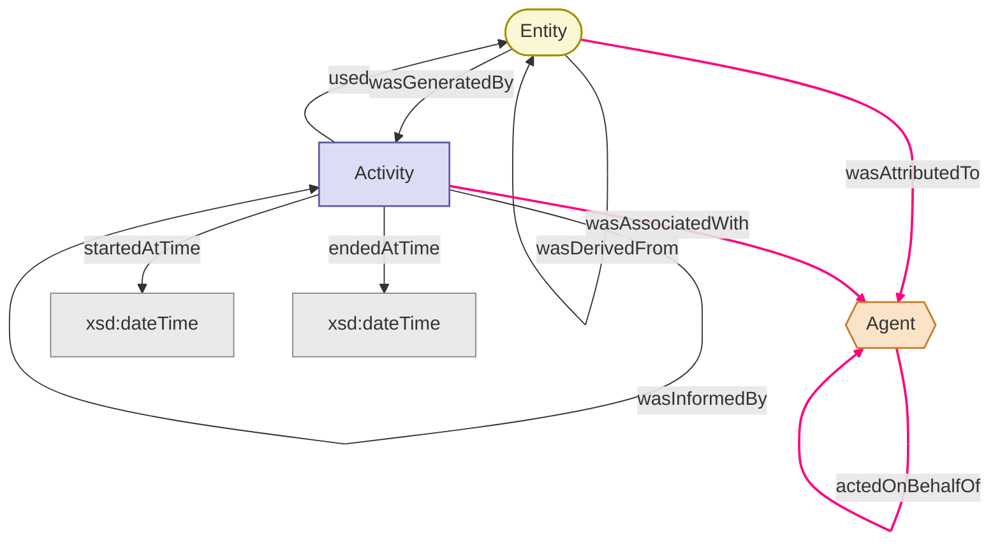
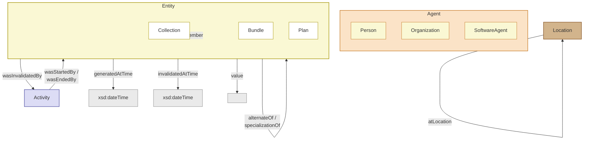

# Agent 可观测性

## 可观测性规范

### OpenInference 规范

[OpenInference 规范](https://github.com/Arize-ai/openinference) 是一个建立在 OpenTelemetry 之上的开源语义约定标准，专门用于大语言模型（LLM）和 AI 应用的可观测性。该规范以 Markdown 文件的形式编辑，这些文件位于 [spec 目录](https://github.com/Arize-ai/openinference/tree/main/spec) 中。它旨在深入剖析 LLM 的调用以及相关的应用程序上下文，例如从向量存储中检索数据以及使用外部工具（如搜索引擎或 API）。该规范与传输方式和文件格式无关，旨在与其他规范（例如 JSON、ProtoBuf 和 DataFrames）结合使用。

### PROV

PROV 系列文档定义了一个模型、相应的序列化和其他支持性定义，以实现异构环境（例如 Web）中溯源信息的互操作交换。

PROV 的核心是一个概念数据模型（PROV-DM），它定义了一套用于描述溯源信息的通用词汇表。该词汇表通过各种序列化方式进行实例化。这些序列化方式被各种实现用于交换溯源信息。为了帮助开发者和用户表达有效的溯源信息，又定义了一组约束（PROV-Constraints），这些约束可用于实现溯源验证器。此外，还提供了形式语义（PROV-SEM）。最后，为了进一步支持溯源信息的交换，还提供了额外的规范，用于定义溯源信息的定位和访问协议（PROV-AQ）、溯源描述包的连接协议（PROV-Links）、字典式集合的表示协议（PROV-Dictionary）以及定义如何与广泛使用的都柏林核心词汇表（PROV-DC）进行互操作的协议。

<div class="image-grid" style="--cols:1">
  <figure>
    
    <figcaption>PROV 规范家族：PROV-DM 核心、序列化与各支持规范</figcaption>
  </figure>
</div>

| 序号 | 观众类型 | 文档类型 | 简述 |
| :--- | :--- | :--- | :--- |
| 1 | 用户 | 笔记 | **PROV-PRIMER** 是 PROV 的入门指南，它介绍了溯源数据模型。这是您应该开始学习的地方，对许多人来说，也可能是唯一需要的文档。 |
| 2 | 开发者 | 推荐 | **PROV-O** 为溯源数据模型定义了一个轻量级的 OWL2 本体。它面向链接数据和语义网社区。 |
| 3 | 开发者 | 笔记 | **PROV-XML** 定义了溯源数据模型的 XML 模式。它面向需要对 PROV 数据模型进行原生 XML 序列化的开发人员。 |
| 4 | 先进的 | 推荐 | **PROV-DM** 定义了一个包含 UML 图的溯源概念数据模型。PROV-O、PROV-XML 和 PROV-N 是该概念模型的序列化版本。 |
| 5 | 先进的 | 推荐 | **PROV-N** 为溯源模型定义了一种易于理解的符号。它用于在概念模型中提供示例，也用于定义 PROV-CONSTRAINTS。 |
| 6 | 先进的 | 推荐 | **PROV-CONSTRAINTS** 定义了一组针对 PROV 数据模型的约束，用于明确有效溯源的概念。它专门针对验证器的实现者。 |
| 7 | 开发者 | 笔记 | **PROV-AQ** 定义了如何使用基于 Web 的机制来查找和检索溯源信息。 |
| 8 | 开发者 | 笔记 | **PROV-DC** 定义了 Dublin Core 和 PROV-O 之间的映射关系。 |
| 9 | 开发者 | 笔记 | **PROV-DICTIONARY** 定义了用于表达字典式数据结构来源的结构。 |
| 10 | 先进的 | 笔记 | **PROV-SEM** 根据 PROV 数据模型的一阶逻辑定义了一个声明式规范。 |
| 11 | 先进的 | 笔记 | **PROV-LINKS** 定义了 PROV 的扩展，以实现跨多个溯源描述包链接溯源信息。 |

**PROV-O (PROV Ontology)**

[PROV-O (PROV Ontology)](https://www.w3.org/TR/prov-o/) 是万维网联盟（W3C）推荐的基于 OWL2 语言构建的标准网络本体，用于用机器可读的格式描述和交换数据溯源（Provenance）信息。它将现实中“谁、在什么时间、通过什么活动、使用了什么输入、生成了什么输出”的来龙去脉结构化为统一的语义网词汇。

整体来说，PROV 数据模型通过 **活动(Activity)、实体(Entity) 和 代理(Agent)** 三个核心类构建数据溯源链：

1. **活动与实体（生成与使用）**：
  - 动在特定时段内运行（`startedAtTime` / `endedAtTime`），通过使用实体（`prov:used`）和生成实体（`prov:wasGeneratedBy`）建立关联。
  - 若忽略中间实体，活动间可通过 `prov:wasInformedBy` 建立直接依赖链；若忽略中间活动，实体间可直接通过 `prov:wasDerivedFrom` 建立派生链。
2. **代理与责任（归属与授权）**：
  - 代理对活动承担关联责任（`prov:wasAssociatedWith`），对实体承担归属责任（`prov:wasAttributedTo`）。
  - 代理之间可通过委托关系（`prov:actedOnBehalfOf`）代表其他代理履行职责。



进一步的，PROV-O 扩展词汇通过继承、生命周期建模与视角划分，对核心模型进行了五个层面的补充与深化：

1. **核心类的子类与属性扩展**
  - **Agent 子类** ：包含 `prov:Person`（个人）、`prov:Organization`（组织）与 `prov:SoftwareAgent`（软件代理）。
  - **Entity 子类** ：包含 `prov:Collection`（集合实体，用 `prov:hadMember` 声明成员）、`prov:Bundle`（命名的出处描述集合）与 `prov:Plan`（计划或行动步骤）。
  - **派生细化与超属性** ：
    - **派生子属性** ：`prov:wasQuotedFrom`（引用）、`prov:wasRevisionOf`（修订）与 `prov:hadPrimarySource`（一手来源）。
    - **通用影响** ：`prov:wasInfluencedBy` 作为顶层超属性，用于描述任何受影响对象与影响源之间的通用关联。
2. **抽象层级与视角的关联**
  - **`prov:specializationOf`** ：将具体实体指向更一般的实体（如具体日期的网页与常规主页）。
  - **`prov:alternateOf`** ：连接同一事物在不同形式或时间下的不同表现（如文件的不同格式或备份）。
3. **实体细节与空间属性**
  - **`prov:value`** ：直接用字面量表示实体的取值（如字符串或数值）。
  - **`prov:atLocation`** ：将实体、活动、代理或瞬间事件关联到具体的地理/逻辑位置（`prov:Location`）。
4. **实体的生命周期控制**
  - **时间界定** ：通过 `prov:generatedAtTime`（生成时间）和 `prov:invalidatedAtTime`（失效时间）限定实体的存续期。
  - **活动驱动** ：通过 `prov:wasGeneratedBy` / `prov:generated` 表示实体生成，通过 `prov:wasInvalidatedBy` / `prov:invalidated` 表示实体失效。
5. **活动生命周期的扩展控制** ：活动不仅能关联时间的开始与结束，还可以直接由特定实体或代理触发启动（`prov:wasStartedBy`）或终止（`prov:wasEndedBy`）。



PROV-O 的 **“限定模式”（Qualified Pattern）** 则旨在解决 RDF 语法无法直接在“关系/边”上附加属性的局限，通过引入中间节点将简单的二元关系转换为可附加丰富元数据的多元结构。这种方法受影响方与影响源之间插入一个“影响类实例”（Influence Instance），建立 **“受影响方 → 影响事件 → 影响源”** 的三段式结构，从而允许在“影响事件”节点上挂载上下文属性。

<div class="image-grid" style="--cols:1">
  <figure>
    
    <figcaption>PROV-O 限定模式：受影响方 → 影响事件 → 影响源</figcaption>
  </figure>
</div>

**PROV-Constraints**

在构建了 PROV-O 本体后，接下来便需要考虑 [PROV 约束](https://www.w3.org/TR/prov-constraints/)。一个有效 (valid，PROV 实例/文档中的有效在概念上更接近于逻辑上的一致性 (consistency)) 的 PROV 实例对应于一个一致的对象和交互历史记录，可以安全地对其进行逻辑推理。通过指定约束条件来验证 PROV 实例 有效的 PROV 实例必须满足以下条件。这些约束共有四种：唯一性约束 (uniqueness constraints)、事件顺序约束 (event ordering constraints)、不可能性约束 (impossibility constraints) 和类型约束 (type constraints)。

在 PROV 中， **并不假设列出的属性集实体描述并不完整，属性之间也并非相互独立或正交** 。同样，也 **不假设实体的属性能够唯一地标识该实体** 。两个不同的实体如果展现了可能不同的事物的相同方面，则可能拥有相同的属性；这会导致潜在的歧义，而 **使用标识符可以减轻这种歧义** 。

活动并非实体。事实上，实体在其生命周期的任何时刻都完整存在，并持续存在，且保持其固有的特征。与之相反，活动是随着时间推移而发生、展开或发展的事物。这种区别类似于逻辑学中“持续性”和“偶发性”的区别。

PROV 中使用了5种瞬时事件：

- 活动开始和活动结束界定了活动产生与终止的边界
- 实体产生、实体使用和实体失效事件均作用于实体，其中实体产生和实体失效事件则界定了实体的生命周期

| 关系 | 标识符/参数 | 具有类型... |
| :--- | :--- | :--- |
| `entity(e,attrs)` | `e` | `'实体'` |
| `activity(a,t1,t2,attrs)` | `a` | `'活动'` |
| `agent(ag,attrs)` | `ag` | `'代理人'` |
| `used(id; a,e,t,attrs)` | `e`<br>`a` | `'实体'`<br>`'活动'` |
| `wasGeneratedBy(id; e,a,t,attrs)` | `e`<br>`a` | `'实体'`<br>`'活动'` |
| `wasInformedBy(id; a2,a1,attrs)` | `a2`<br>`a1` | `'活动'`<br>`'活动'` |
| `wasStartedBy(id; a2,e,a1,t,attrs)` | `a2`<br>`e`<br>`a1` | `'活动'`<br>`'实体'`<br>`'活动'` |
| `wasEndedBy(id; a2,e,a1,t,attrs)` | `a2`<br>`e`<br>`a1` | `'活动'`<br>`'实体'`<br>`'活动'` |
| `wasInvalidatedBy(id; e,a,t,attrs)` | `e`<br>`a` | `'实体'`<br>`'活动'` |
| `wasDerivedFrom(id; e2,e1,a,g,u,attrs)` | `e2`<br>`e1`<br>`a` | `'实体'`<br>`'实体'`<br>`'活动'` |
| `wasAttributedTo(id; e,ag,attr)` | `e`<br>`ag` | `'实体'`<br>`'代理人'` |
| `wasAssociatedWith(id; a,ag,pl,attrs)` | `a`<br>`ag`<br>`pl` | `'活动'`<br>`'代理人'`<br>`'实体'` |
| `actedOnBehalfOf(id; ag2,ag1,a,attrs)` | `ag2`<br>`ag1`<br>`a` | `'代理人'`<br>`'代理人'`<br>`'活动'` |
| `alternateOf(e1,e2)` | `e1`<br>`e2` | `'实体'`<br>`'实体'` |
| `specializationOf(e1,e2)` | `e1`<br>`e2` | `'实体'`<br>`'实体'` |
| `hadMember(c,e)` | `c`<br>`e` | `'实体'`, `'prov:Collection'`<br>`'实体'` |
| `entity(c,[prov:type='prov:EmptyCollection',...])` | `c` | `'实体'`, `'prov:Collection'`, `'prov:EmptyCollection'` |

总体来说，PROV 数据变“规范”的过程是：先用类型、时序和逻辑约束进行“健康检查”（Validation），剔除不合规的错误数据；再根据定义与推理规则补充隐含信息、合并重复项（Normalization），最终把一份原始数据加工成标准、完备的 PROV 数据。

<div class="image-grid light-fig" style="--cols:1">
  <figure>
    
    <figcaption>PROV 数据规范化流程总览：Validation（健康检查）与 Normalization（补全合并）</figcaption>
  </figure>
</div>

在文档中，各种具体的约束条件被详细定义，且针对各概念和推论提供了标准性的解释，它们也为整个 PROV 体系提供了一致性约束。

另外，PROV 也提供了语义逻辑和语义学的证明 [PROV-SEM](https://www.w3.org/TR/prov-sem/)，主要运用数理逻辑工具，特别是模型论，帮助用户理解 PROV 某些特性背后的意图，也有助于研究人员探索更丰富的溯源推理形式；状态图的绘制则参考 [PROV SCXML](https://www.w3.org/TR/scxml/)。

### OCELs

面向对象事件日志（OCELs）构成了面向对象过程挖掘（OCPM）的基础。OCEL 1.0 于 2020 年首次发布，并推动了 OCPM 技术的发展。OCEL 2.0 是新的、更具表达力的标准，允许进行更广泛的过程分析，同时保持易于交换的格式。

早期的过程挖掘算法诞生于20世纪90年代末，最初，采用范围有限，只有少数研究人员关注该领域。然而，随着时间的推移，该领域逐渐成熟。然而，传统流程挖掘主要考虑涉及单个案例的流程、其事件和事件属性。当处理复杂、多维的流程时，这种方法的局限性就显现出来，因为这些流程中的事件可能与多种实体或对象相关联，而这些实体或对象会随着时间的推移而互动和演变。

面向对象流程挖掘（OCPM）代表了一种范式转变，旨在解决并克服传统面向案例的流程挖掘方法的固有局限性。 OCPM 从 ERP（企业资源计划）、CRM（客户
关系管理）、MES（制造执行系统）和其他 IT 系统中实际的事件和对象出发，这些事件和对象会在这些系统的数据库中留下痕迹。在这样系统的数据库中，一对一关系是例外。大多数关系是一对多或多对多。因此，需要转换数据才能将事件分配给单个案例，从而导致之前提到的问题。因此，经验丰富的流程挖掘人员普遍认为，面向对象事件数据（OCED）比经典的基于案例的事件日志提供了对现实更好的抽象。

在讨论 OCEL 2.0 前，我们首先需要介绍一些术语和基本概念：

- **事件**：面向对象的流程挖掘基于离散事件。它们代表了系统或流程中发生的各种动作或活动，例如批准订单、发货或付款。每个事件都是唯一的，对应于特定时间点的特定动作或观察。事件是原子的（即不占用时间）、具有时间戳，并可能具有其他属性。事件是分类型的。
- **事件类型**：根据其性质或功能，事件被分类为不同类型。例如，采购流程可能具有订单创建、订单批准或发票发送等事件类型。每种类型的事件代表流程中可以发生的特定动作。每个事件恰好属于一种类型。有时，我们使用活动一词来指代事件类型。
- **对象**：在面向对象的流程挖掘中，对象代表参与事件中的实体。这些可能是物理项目，如供应链中的产品、机器、工人，或抽象/信息实体，如采购流程中的订单、发票或合同。对象具有带有值的属性，例如价格。这些值可能会随时间变化。
- **对象类型**：每个对象都是一种类型。对象是其类型的实例化。对象类型可能包括产品、订单、发票或供应商等类别。

事件和对象可能相关。特别是，OCPM 技术利用以下两种关系：

- **事件-对象（E2O）关系**：事件与对象相关联。这种关系描述了对象如何影响事件，或事件如何影响对象。与传统事件日志不同，事件可以与多个对象相关联。此外，这些关系可以有不同的限定词，描述对象在特定事件发生中所扮演的角色。
- **对象间（O2O）关系**：对象也可以在事件上下文之外与其他对象相关联。例如，一名员工可能是某个组织单元的一部分。除了关系的存在本身，这种关系还可以被限定（例如，属于、汇报给或归属于）。

<div class="image-grid" style="--cols:1">
  <figure>
    
    <figcaption>OCEL 2.0 元模型：事件-对象（E2O）与对象间（O2O）关系</figcaption>
  </figure>
</div>

具体细节和相关字段设计可参考 [OCEL 2.1 规范文档](https://www.ocel-standard.org/2.1/ocel20_specification.pdf)。

### IEEE XES

XES 标准定义了一种基于标签的语言的语法，旨在为信息系统设计人员提供一种统一的、可扩展的方法，通过事件日志和事件流来捕获系统的行为。该标准包含一个“XML 模式”，描述了XES 事件日志/流的结构，以及一个“XML 模式”，描述了此类日志/流的扩展结构。此外，该标准还包含一组基本的所谓“XES 扩展”原型，这些原型为事件日志/流中记录的某些属性提供语义。

本标准的目的是为不同应用领域的信息系统之间以及用于分析此类数据的分析工具之间提供一种普遍认可的 XML 格式用于交换事件数据。因此，本标准旨在规范事件数据的语法和语义，例如，将此类数据从生成数据的站点传输到分析数据的站点。由于本标准，如果使用本标准描述的语法传输事件数据，其语义在两个站点都将被充分理解和明确。

XES 的元数据结构包括：

- **层次组件**
  - **日志组件**：表示与特定流程相关的信息，例如处理保险索赔、使用复杂的X射线机器以及浏览网站等。日志应包含一个（可能为空的）跟踪集合，后跟一个（可能为空的）事件列表。此列表中事件的顺序很重要，因为它表示事件被观察的顺序。
  - **跟踪组件**：表示单个案例的执行，即特定过程的单个执行（或实施）。跟踪应包含一个（可能为空）与单个案例相关的事件列表。此列表中事件的顺序很重要，因为它表示事件被观察到的顺序。
  - **事件组件**：表示一个被观察到的活动的基本单元。如果事件出现在某个跟踪中，那么它属于哪个用例就很清楚。如果事件没有出现在某个跟踪中，也就是说它出现在日志中，那么就需要方法来将事件与用例关联起来。为此，将使用跟踪分类器和事件分类器的组合。
- **属性组件**：任何组件（日志、跟踪或事件）的信息都存储在属性组件中。属性描述了包含它们的组件，该组件可以包含任意数量的属性。然而，同一个组件的两个属性不能共享相同的键；也就是说，每个键在一个组件中只应出现一次。为实现最大灵活性，XES 标准允许嵌套属性。
  - **基本属性**：指应当包含基本（单一、基本）值的属性。在本标准中，基本属性应当是字符串属性、日期时间属性、整数数字属性、实数数字属性、布尔属性或ID属性。
    - **字符串属性**：有效值是符合 `xs: string` 数据类型的值。
    - **日期和时间属性**：值应指定为协调世界时（见 ISO 8601），也称为祖鲁时，并以 `xs: dateTime` 数据类型表示。
    - **整数数字属性**：有效值是符合 `xs: long` 数据类型的值。
    - **实数数字属性**：有效值是符合 `xs: double` 数据类型的值。
    - **布尔属性**：合法值是符合 `xs: boolean` 数据类型的值。
    - **ID属性**：合法值是符合 ID 数据类型的值，即所有表示通用唯一标识符（UUID）的字符串表示形式。
  - **组合属性**：一种可能包含多个值的属性。在本标准中，组合属性必须是列表属性。
    - **列表属性**：列表数据类型的有效值是所有属性值列表（序列）。此列表中子属性的顺序很重要。与组件内的属性不同，此类属性值列表内的属性可以共享相同的键。请注意，属性值列表与列表属性不同：前者包含后者，后者是组件，但前者不是。
- **全局属性**：日志应包含（可能为空的）全局属性声明列表。全局属性声明应具有有效的键、有效的数据类型以及该数据类型的有效值。全局属性声明应为全局事件属性或全局跟踪属性。
  - **全局事件属性**：指被理解为在日志中的每个事件（无论是否为跟踪）都可用且正确定义的事件属性。
  - **全局跟踪属性**：指那些被理解为在日志中的每个跟踪中都可用且正确定义的跟踪属性。
- **分类器**：日志应包含一个（可能为空的）分类器列表。分类器为每个事件分配一个身份，使其可以通过分配的身份与其他事件进行比较。
  - **事件分类器**：通过有序的属性键列表来定义。
  - **跟踪分类器**：应当通过一个有序的属性键列表来定义。跟踪的身份应当从具有这些键的属性的实际值中导出。
  - **事件排序**：在单个跟踪的上下文中，事件的顺序应当是重要的。无论用户选择何种分类器，日志中的顺序都应保持不变：属于某个轨迹的第一个事件应是日志中遇到的第一个事件（无论它是在轨迹中还是在日志本身中）。
- **扩展**：扩展通过为每种组件类型定义（可能为空的）属性集来定义一个（非空的）属性集。扩展为解释这些属性及其组件提供了参考点，因此，它们主要是将语义附加到每个组件定义的属性集的载体。

<div class="image-grid" style="--cols:1">
  <figure>
    
    <figcaption>XES 元数据结构总览：层次组件、属性组件、全局属性、分类器与扩展</figcaption>
  </figure>
  <figure>
    
    <figcaption>XES XML 序列化状态机流程图</figcaption>
  </figure>
</div>

IEEE XES 中包含了很多细节的基础字段和扩展字段定义，并绘制了多幅不同模型的状态机图，具体信息可在 [1849-2023 - IEEE Standard for eXtensible Event Stream (XES) for Achieving Interoperability in Event Logs and Event Streams](https://ieeexplore.ieee.org/document/10267858) 中查看。

### CloudEvents

[CloudEvents](https://cloudevents.io/) 是一种用于以通用方式描述事件数据的规范。该规范旨在实现不同服务、平台和系统之间的互操作性。该规范定义了一系列术语，如事件(Occurrence)、活动/事件(Event)、生产者(Producer)、消费者(Consumer)、中介(Intermediary)、上下文(Context)等；同时定义了一系列的上下文属性(context attributes)、事件数据(event data)，其代码仓库在 [cloudevents spec](https://github.com/cloudevents/spec) 中。

### Model Context Protocol

模型上下文协议（Model Context Protocol，MCP）是一种开放式的协议，能够实现大型语言模型应用程序与外部数据来源和工具的无缝集成。无论是构建基于人工智能的集成开发环境，改进聊天界面，还是创建自定义的人工智能工作流程，MCP 都提供了一种标准化的方式，让大型语言模型能够连接到所需的上下文信息。

MCP 提供了一种标准化的方式，让应用程序能够：

- 与语言模型共享上下文信息
- 将工具和功能暴露给人工智能系统使用
- 构建可组合化的集成和工作流程

该协议使用 JSON-RPC 2.0 消息来在以下组件之间建立通信：

- **主持人 (Hosts)**：发起连接的 LLM 应用程序
- **客户 (Clients)**：主机应用程序中的连接器
- **服务器 (Servers)**：提供相关信息和功能的服务

MCP 借鉴了 [Language Server](https://microsoft.github.io/language-server-protocol/) 协议的设计理念，该协议规范了如何在整个开发工具生态系统中添加对各种编程语言的支持。同样地，MCP 也规范了如何将额外的上下文信息和工具集成到 AI 应用生态系统中。

### Agent2Agent Protocol

[Agent2Agent（A2A）协议](https://a2a-protocol.org/latest/specification/) 是一种开放标准，旨在促进独立且可能具有不透明特性的 AI 代理系统之间的通信与互操作性。在这样一个由不同框架、语言或来自不同供应商的代理构成的生态系统中，A2A 协议提供了一种通用的交互模型与沟通方式。

其主要目标是：

- **互操作性 (Interoperability)**：打破不同智能系统之间的通信障碍。
- **协作 (Collaboration)**：让代理能够分配任务、共享信息，并共同处理复杂的用户请求。
- **发现 (Discovery)**：让代理能够动态地识别和理解其他代理的功能特性。
- **灵活性 (Flexibility)**：支持多种交互模式，包括同步的请求与响应、用于实时更新的流式传输，以及适用于长期运行任务的异步推送通知功能。
- **安全性 (Security)**：采用符合企业环境的安全通信模式，遵循标准的网络安全实践。
- **异步性 (Asynchronicity)**：原生支持长时间运行的任务和交互，这些任务和交互可能涉及人为干预的场景。

该协议分为三个层次：

- 规范数据模型 (Canonical Data Model)：定义了所有 A2A 实现必须理解的核心数据结构和消息格式。这些定义都是与协议无关的，以 Protocol Buffer 消息的形式呈现。
- 抽象操作 (Abstract Operations)：描述了 A2A 代理必须支持的基本功能和行为，而这些功能和行为并不依赖于它们是通过哪些具体协议来传输的。
- 协议绑定 (Protocol Bindings)：详细描述了如何将抽象操作和数据结构具体映射到特定的协议绑定方式（JSON-RPC、gRPC、HTTP/REST），包括方法名称、端点模式以及协议特定的行为特征。

这种分层方法能够确保：

- 核心语义在所有协议绑定中保持一致性。
- 可以在不改变基本数据模型的情况下添加新的协议绑定。
- 开发者可以独立于绑定问题来思考 A2A 操作的相关事宜。
- 通过共同理解规范化的数据模型，实现了各系统之间的互操作性。

相关的核心概念、操作等可在A2A文档中具体查看。

## Cantilune Observability

### Cantilune Atomic Observability Core

Cantilune 的原子观测性内核包含三个对象和六条关系：

- **对象 (Object)**
  - **责任主体 (Principal)**：在观测边界内具有稳定身份，并能够对行为的决策、执行、承载、控制、传输或结果归属承担责任的主体。
  - **发生过程 (Activity)**：在时间中实际发生的一次操作、过程、交互或转换。
  - **实体 (Entity)**：能够被稳定标识、引用、传输、保存、比较或追溯的内容、消息、请求、结果、配置、状态或产物。
- **关系 (Relation)**
  - `participatesIn(p, a)`：回答“谁参与了这个过程”，Principal 对 Activity 的发生承担某种责任
  - `informs(a_1, a_2)`：回答“哪个过程影响了哪个过程”，即前一个 Activity 所产生的信息对后一个 Activity 的发生具有影响
  - `generates(a, e)`/`uses(a, e)`：回答“这个过程产生了什么/这个过程使用了什么”，即Activity 的发生使一个新的 Entity 出现，或Activity 的发生依赖、读取、消费或处理了某个 Entity
  - `derivedFrom(e_1, e_2)`：回答“这个实体来源于什么”，即当前 Entity 的形成依赖于另一个 Entity
  - `attributedTo(e, a)`：回答“这个实体归责于谁”，即某 Principal 对该 Entity 的形成或存在承担责任
  - `onBehalfOf(p_1. p_2)`：回答“责任主体之间的联系”，即其中一个责任主体委托了另一个责任主体。

<div class="image-grid" style="--cols:1">
  <figure>
    
    <figcaption>Cantilune 原子核模型：对象（Principal / Activity / Entity）与关系总览</figcaption>
  </figure>
</div>

基于 Atomic Core，我们为对象与关系设计了相互对称的“语义类型—具体实例”结构，使内核保持稳定，同时允许 Agent 系统中的具体概念和运行事实持续扩展。 对于三个核心对象类别 `CoreKind`，系统设置： 

- **`SemanticTypeDefinition`**：定义一类对象的具体语义，例如 `Human`、`Agent`、`Shell`、`ToolExecution`、`Prompt` 或 `Dataset`。它负责说明该类型属于 `Principal`、`Activity` 或 `Entity` 中的哪一类，以及类型名称、语义定义、父类型、属性结构和治理状态。 
- **`AtomInstance`**：表示某个 Semantic Type 在真实 Agent 运行过程中的具体实例，例如某个用户、某个 Shell、某次工具执行或某条实际 Prompt。它通过 `semanticTypeId` 关联对应的 `SemanticTypeDefinition`，并保存该实例自身的名称和属性。 

对于六类核心关系 `CoreRelationKind`，系统设置： 

- **`SemanticRelationTypeDefinition`**：在核心关系之上定义更具体的关系语义，例如某个 Principal 以“执行者”身份参与 Activity、某个 Agent 在特定任务范围内代表 Human 行动，或某个 Entity 是另一个 Entity 的摘要结果。它负责规定关系所属的核心关系、允许连接的语义类型及关系限定信息。 
- **`RelationInstance`**：表示两个具体 `AtomInstance` 之间实际成立的一条关系。它记录关系类型、起点实例、终点实例，以及角色、作用域、通信通道或派生方式等具体限定信息。 

通过这一结构，`CoreKind` 和 `CoreRelationKind` 提供稳定、最小的语义骨架，Semantic Type 描述“它是什么”，Semantic Relation Type 描述“它们如何关联”，而 Atom Instance 与 Relation Instance 则将这些抽象定义落实为 Agent 系统运行过程中真实发生的对象与关系。

<div class="code-grid" style="--cols:2">

```ts
interface AtomInstance {
  /** 当前对象实例的全局稳定标识。 */
  readonly instanceId: string;

  /**
   * 当前对象所属的精确 Semantic Type id
   * 均可通过该标识解析得到。
   */
  readonly semanticTypeId: SemanticTypeId;

  /** 当前具体实例的人类可读名称。 */
  readonly label?: string;

  /**
   * 对当前具体实例的说明。
   *
   * 这不是类型语义定义；
   * 类型语义已经位于 SemanticTypeDefinition.description。
   */
  readonly description?: string;

  /**
   * 当前实例特有的数据。
   *
   * 数据结构由对应 SemanticTypeDefinition.schemaRef 验证。
   */
  readonly attributes?: Readonly<Record<string, unknown>>;
}
```

```ts
interface SemanticTypeDefinition {
  /** 全局稳定、带命名空间的类型标识 */
  readonly typeId: SemanticTypeId;

  /** 它属于 Atomic Core 中的哪一种对象 */
  readonly coreKind: CoreKind;

  /** 人类可读名称 */
  readonly label: string;

  /** 严格的语义定义 */
  readonly description: string;

  /** 更一般的父类型，可为空 */
  readonly parentTypeIds?: readonly SemanticTypeId[];

  /** 该类型实例允许/要求携带的数据结构 */
  readonly schemaRef?: SchemaRef;

  /** 类型定义本身的版本 */
  readonly version: string;

  /** 生命周期状态，仅用于类型治理 */
  readonly status: Status;
}
```

```ts
interface SemanticRelationTypeDefinition {
  /** 全局稳定、带命名空间的关系类型标识。 */
  readonly relationTypeId: string;

  /**
   * 当前关系类型所属的 Atomic Core 关系。
   * 决定最基础的方向和 CoreKind domain/range。
   */
  readonly coreRelationKind: CoreRelationKind;

  /** 人类可读名称。 */
  readonly label: string;

  /** 严格的语义定义 */
  readonly description: string;

  /** 更一般的父类型，可为空 */
  readonly parentRelationTypeIds?: readonly string[];

  /** 允许作为 source 的 Semantic Type。*/
  readonly sourceTypeIds?: readonly SemanticTypeId[];

  /** 允许作为 target 的 Semantic Type。*/
  readonly targetTypeIds?: readonly SemanticTypeId[];

  /**
   * 关系实例允许或要求携带的限定信息。
   */
  readonly qualifierSchemaRef?: SchemaRef;

  /** 类型定义本身的治理版本。 */
  readonly version: string;

  /** 关系类型当前的治理状态。 */
  readonly status: Status;

}
```

```ts
interface RelationInstance {
  /**
   * 当前关系实例的全局稳定标识。
   * 不能简单使用 source + target 作为标识，
   * 因为相同端点之间可以存在多条不同关系。
   */
  readonly relationId: string;

  /** 当前关系所属的最具体 Semantic Relation Type。*/
  readonly semanticRelationTypeId: string;

  /**
   * 关系起点 AtomInstance 的标识。
   * 起点和终点方向由 SemanticRelationTypeDefinition
   * 对应的 coreRelationKind 决定。
   */
  readonly sourceAtomId: string;

  /** 关系终点 AtomInstance 的标识。 */
  readonly targetAtomId: string;

  /**
   * 当前具体关系携带的限定信息。
   * 结构由关系类型的 qualifierSchemaRef 验证。
   */
  readonly qualifiers?: Readonly<Record<string, unknown>>;
}
```

```ts
type CoreKind =
  | "principal"
  | "activity"
  | "entity";
```

```ts
type Status =
    | "experimental"
    | "stable"
    | "deprecated";
```

</div>


# Agent Loop 的终止条件

在文章 [深入解析 Codex 智能体循环](https://openai.com/zh-Hans-CN/index/unrolling-the-codex-agent-loop/) 中，OpenAI 归纳了一种最容易的范式用于推进 Agent Loop。在文章中，整个循环停止的条件是，“直至模型不再发起工具调用，转而生成一条面向用户的消息（在 OpenAI 模型中称为助手消息）”。但是其问题在于，以“生成助手消息”为标志判断 Agent Loop 从而终止当前轮对话，本质上是 **“通过形式判断终止”** ，而非 **内容** 。

无独有偶，Anthropic 在文章 [How the agent loop works](https://code.claude.com/docs/en/agent-sdk/agent-loop) 中同样描述了类似的过程：接收提示信息-进行评估并作出响应-执行工具-重复操作-返回结果。文章中写道：“Turns continue until Claude produces output with no tool calls, at which point the loop ends and the final result is delivered.”

两种典型的 Agent Loop 范式如下图所示，分别为 OpenAI 的 Codex 多轮智能体循环与 Anthropic Claude 的 Agent Loop：

<div class="image-grid" style="--cols:1">
  <figure>
    
    <figcaption>OpenAI Codex 多轮智能体循环</figcaption>
  </figure>
  <figure>
    
    <figcaption>Anthropic Claude Agent Loop</figcaption>
  </figure>
</div>

但是，这样的建模方式使 Agent Loop 在终止条件的判定上陷入到了严重的形式化洼地：严重依赖模型本身，且实际终止条件不一定满足预期。举一个简单的例子，模型因为不可纠正的格式错误，导致本应是调用 MCP 工具的行为回堕为纯文本输出，该输出是没有 `tool_calls` 的纯文本，因而对话终止(猫猫就在今天使用claude code时遇到了这种情况)。

针对上述问题，猫猫想到了一种最简单的做法： $J(g, r_t) \to [0,1]$，其中 $g$ 是目的， $r_t$ 是回复， $J$ 为一个判分器 (LLM as a Judge)，当评分超过一定阈值则说明 Agent Loop 完成了目标，便可以停止。进一步的，可以得到更有意思的方法，通过探索目的和回复之间的向量空间关系、来去作空间上的预期逼近从而“计算出”差异，进而产生出信号用于判断 Agent Loop 是否应该结束。

下面，我们用更严谨的数学模型来表示整个过程。

## 设计定义

### 定义目标

首先，对于任意需求都必然有一个目标，这个目标可以建模为：

$$\mathcal{G}=\{ (c_i , w_i , \tau_i , k_i , v_i) \}_{i=1}^{m}$$

其中：

- $c_i$: 第 i 个验收条件
- $w_i$: 重要性
- $\tau_i$: 通过阈值
- $k_i \in \{ \text{hard} , \text{soft} \}$: 硬条件或软条件
- $v_i$: 对应验证器

例如：

```yaml
goal: 修复重复回复问题

criteria:
  - id: no_duplicate_output
    type: hard
    verifier: duplicate_message_test
    threshold: 1.0

  - id: normal_chat_yields
    type: hard
    verifier: integration_test
    threshold: 1.0

  - id: tool_task_continues
    type: hard
    verifier: regression_test
    threshold: 1.0

  - id: architecture_quality
    type: soft
    verifier: structured_rubric
    weight: 0.3
```

### 定义评价对象

评价对象应该是一个完整的状态而非最终回复，其可以表示为：

$$x_t = (S_t , A_t , E_t , \Tau_{ \leq t} , R_t )$$

- $S_t$: 环境或系统状态
- $A_t$: 代码、论文、文件、图谱等产物
- $E_t$: 测试、工具结果、引用、日志等证据
- $\Tau_{ \leq t}$: 完整执行轨迹
- $R_t$: 准备发送给用户的回复

其中，回复只是其中一个分量。否则模型只要说“已经完成”，目标与回复的语义相似度就会非常高，堪称文字版伪造竣工验收。

## 计算目标满足度

基于如上建模，每个条件会产生 $q_{i,t}=v_{i}(c_i , x_t ) \in [0,1]$，同时定义证据可信度 $\rho_{i,t} \in [0,1]$，进而可以得到硬条件门：

$$H_{t}= \underset{i:k_i=\text{hard} }{\Pi}\mathbb{I}[q_{i,t} \rho_{i,t} \geq \tau_{i}]$$

总体完成度为：

$$C_t = \frac{\Sigma_{i} w_i q_{i,t} \rho_{i,t} }{\Sigma_{i} w_i}$$

不确定度为：

$$U_t = \frac{\Sigma_{i} w_i (1-\rho_{i,t}) }{\Sigma_{i} w_i}$$

当 $C_t$ 较高则说明完成度较高，但如果同时 $U_t$ 较高则说明不确定度较大，从而需要进入核验环节。

## 开放文本目标

对于“论文论证充分”“报告覆盖完整”等难以写成精确断言的条件，可以使用 embedding，但只把它当作语义传感器。

