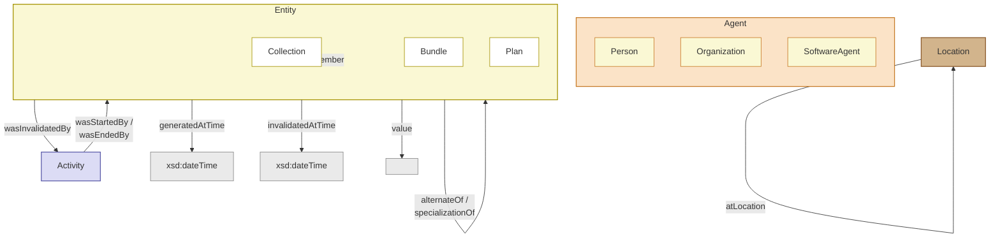

# 单 Agent 系统

## Agent 可观测性

### OpenInference 规范

[OpenInference 规范](https://github.com/Arize-ai/openinference) 是一个建立在 OpenTelemetry 之上的开源语义约定标准，专门用于大语言模型（LLM）和 AI 应用的可观测性。该规范以 Markdown 文件的形式编辑，这些文件位于 [spec 目录](https://github.com/Arize-ai/openinference/tree/main/spec) 中。它旨在深入剖析 LLM 的调用以及相关的应用程序上下文，例如从向量存储中检索数据以及使用外部工具（如搜索引擎或 API）。该规范与传输方式和文件格式无关，旨在与其他规范（例如 JSON、ProtoBuf 和 DataFrames）结合使用。

### PROV-O (PROV Ontology)

[PROV-O (PROV Ontology)](https://www.w3.org/TR/prov-o/) 是万维网联盟（W3C）推荐的基于 OWL2 语言构建的标准网络本体，用于用机器可读的格式描述和交换数据溯源（Provenance）信息。它将现实中“谁、在什么时间、通过什么活动、使用了什么输入、生成了什么输出”的来龙去脉结构化为统一的语义网词汇。

整体来说，PROV 数据模型通过 **活动(Activity)、实体(Entity) 和 代理(Agent)** 三个核心类构建数据溯源链：

1. **活动与实体（生成与使用）**：
  - 动在特定时段内运行（`startedAtTime` / `endedAtTime`），通过使用实体（`prov:used`）和生成实体（`prov:wasGeneratedBy`）建立关联。
  - 若忽略中间实体，活动间可通过 `prov:wasInformedBy` 建立直接依赖链；若忽略中间活动，实体间可直接通过 `prov:wasDerivedFrom` 建立派生链。
2. **代理与责任（归属与授权）**：
  - 代理对活动承担关联责任（`prov:wasAssociatedWith`），对实体承担归属责任（`prov:wasAttributedTo`）。
  - 代理之间可通过委托关系（`prov:actedOnBehalfOf`）代表其他代理履行职责。


进一步的，PROV-O 扩展词汇通过继承、生命周期建模与视角划分，对核心模型进行了五个层面的补充与深化：

1. **核心类的子类与属性扩展**
  - **Agent 子类** ：包含 `prov:Person`（个人）、`prov:Organization`（组织）与 `prov:SoftwareAgent`（软件代理）。
  - **Entity 子类** ：包含 `prov:Collection`（集合实体，用 `prov:hadMember` 声明成员）、`prov:Bundle`（命名的出处描述集合）与 `prov:Plan`（计划或行动步骤）。
  - **派生细化与超属性** ：
    - **派生子属性** ：`prov:wasQuotedFrom`（引用）、`prov:wasRevisionOf`（修订）与 `prov:hadPrimarySource`（一手来源）。
    - **通用影响** ：`prov:wasInfluencedBy` 作为顶层超属性，用于描述任何受影响对象与影响源之间的通用关联。
2. **抽象层级与视角的关联**
  - **`prov:specializationOf`** ：将具体实体指向更一般的实体（如具体日期的网页与常规主页）。
  - **`prov:alternateOf`** ：连接同一事物在不同形式或时间下的不同表现（如文件的不同格式或备份）。
3. **实体细节与空间属性**
  - **`prov:value`** ：直接用字面量表示实体的取值（如字符串或数值）。
  - **`prov:atLocation`** ：将实体、活动、代理或瞬间事件关联到具体的地理/逻辑位置（`prov:Location`）。
4. **实体的生命周期控制**
  - **时间界定** ：通过 `prov:generatedAtTime`（生成时间）和 `prov:invalidatedAtTime`（失效时间）限定实体的存续期。
  - **活动驱动** ：通过 `prov:wasGeneratedBy` / `prov:generated` 表示实体生成，通过 `prov:wasInvalidatedBy` / `prov:invalidated` 表示实体失效。
5. **活动生命周期的扩展控制** ：活动不仅能关联时间的开始与结束，还可以直接由特定实体或代理触发启动（`prov:wasStartedBy`）或终止（`prov:wasEndedBy`）。



PROV-O 的 **“限定模式”（Qualified Pattern）** 则旨在解决 RDF 语法无法直接在“关系/边”上附加属性的局限，通过引入中间节点将简单的二元关系转换为可附加丰富元数据的多元结构。这种方法受影响方与影响源之间插入一个“影响类实例”（Influence Instance），建立 **“受影响方 → 影响事件 → 影响源”** 的三段式结构，从而允许在“影响事件”节点上挂载上下文属性。

<div class="image-grid" style="--cols:1">
  <figure>
    
    <figcaption>PROV-O 限定模式：受影响方 → 影响事件 → 影响源</figcaption>
  </figure>
</div>


# Agent Loop 的终止条件

在文章 [深入解析 Codex 智能体循环](https://openai.com/zh-Hans-CN/index/unrolling-the-codex-agent-loop/) 中，OpenAI 归纳了一种最容易的范式用于推进 Agent Loop。在文章中，整个循环停止的条件是，“直至模型不再发起工具调用，转而生成一条面向用户的消息（在 OpenAI 模型中称为助手消息）”。但是其问题在于，以“生成助手消息”为标志判断 Agent Loop 从而终止当前轮对话，本质上是 **“通过形式判断终止”** ，而非 **内容** 。

无独有偶，Anthropic 在文章 [How the agent loop works](https://code.claude.com/docs/en/agent-sdk/agent-loop) 中同样描述了类似的过程：接收提示信息-进行评估并作出响应-执行工具-重复操作-返回结果。文章中写道：“Turns continue until Claude produces output with no tool calls, at which point the loop ends and the final result is delivered.”

两种典型的 Agent Loop 范式如下图所示，分别为 OpenAI 的 Codex 多轮智能体循环与 Anthropic Claude 的 Agent Loop：

<div class="image-grid" style="--cols:1">
  <figure>
    
    <figcaption>OpenAI Codex 多轮智能体循环</figcaption>
  </figure>
  <figure>
    
    <figcaption>Anthropic Claude Agent Loop</figcaption>
  </figure>
</div>

但是，这样的建模方式使 Agent Loop 在终止条件的判定上陷入到了严重的形式化洼地：严重依赖模型本身，且实际终止条件不一定满足预期。举一个简单的例子，模型因为不可纠正的格式错误，导致本应是调用 MCP 工具的行为回堕为纯文本输出，该输出是没有 `tool_calls` 的纯文本，因而对话终止(猫猫就在今天使用claude code时遇到了这种情况)。

针对上述问题，猫猫想到了一种最简单的做法： $J(g, r_t) \to [0,1]$，其中 $g$ 是目的， $r_t$ 是回复， $J$ 为一个判分器 (LLM as a Judge)，当评分超过一定阈值则说明 Agent Loop 完成了目标，便可以停止。进一步的，可以得到更有意思的方法，通过探索目的和回复之间的向量空间关系、来去作空间上的预期逼近从而“计算出”差异，进而产生出信号用于判断 Agent Loop 是否应该结束。

下面，我们用更严谨的数学模型来表示整个过程。

## 设计定义

### 定义目标

首先，对于任意需求都必然有一个目标，这个目标可以建模为：

$$\mathcal{G}=\{ (c_i , w_i , \tau_i , k_i , v_i) \}_{i=1}^{m}$$

其中：

- $c_i$: 第 i 个验收条件
- $w_i$: 重要性
- $\tau_i$: 通过阈值
- $k_i \in \{ \text{hard} , \text{soft} \}$: 硬条件或软条件
- $v_i$: 对应验证器

例如：

```yaml
goal: 修复重复回复问题

criteria:
  - id: no_duplicate_output
    type: hard
    verifier: duplicate_message_test
    threshold: 1.0

  - id: normal_chat_yields
    type: hard
    verifier: integration_test
    threshold: 1.0

  - id: tool_task_continues
    type: hard
    verifier: regression_test
    threshold: 1.0

  - id: architecture_quality
    type: soft
    verifier: structured_rubric
    weight: 0.3
```

### 定义评价对象

评价对象应该是一个完整的状态而非最终回复，其可以表示为：

$$x_t = (S_t , A_t , E_t , \Tau_{ \leq t} , R_t )$$

- $S_t$: 环境或系统状态
- $A_t$: 代码、论文、文件、图谱等产物
- $E_t$: 测试、工具结果、引用、日志等证据
- $\Tau_{ \leq t}$: 完整执行轨迹
- $R_t$: 准备发送给用户的回复

其中，回复只是其中一个分量。否则模型只要说“已经完成”，目标与回复的语义相似度就会非常高，堪称文字版伪造竣工验收。

## 计算目标满足度

基于如上建模，每个条件会产生 $q_{i,t}=v_{i}(c_i , x_t ) \in [0,1]$，同时定义证据可信度 $\rho_{i,t} \in [0,1]$，进而可以得到硬条件门：

$$H_{t}= \underset{i:k_i=\text{hard} }{\Pi}\mathbb{I}[q_{i,t} \rho_{i,t} \geq \tau_{i}]$$

总体完成度为：

$$C_t = \frac{\Sigma_{i} w_i q_{i,t} \rho_{i,t} }{\Sigma_{i} w_i}$$

不确定度为：

$$U_t = \frac{\Sigma_{i} w_i (1-\rho_{i,t}) }{\Sigma_{i} w_i}$$

当 $C_t$ 较高则说明完成度较高，但如果同时 $U_t$ 较高则说明不确定度较大，从而需要进入核验环节。

## 开放文本目标

对于“论文论证充分”“报告覆盖完整”等难以写成精确断言的条件，可以使用 embedding，但只把它当作语义传感器。

